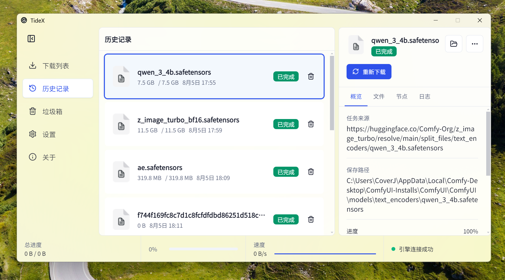

# TideX

TideX 是一款基于 Electron、React 和 aria2 构建的桌面下载管理器。它将 aria2 下载引擎集成到清晰、易用的图形界面中，提供任务创建、进度管理、历史归档、文件校验和应用更新等完整的桌面下载体验。



## 产品特点

- **多种下载来源**：支持 HTTP/HTTPS、FTP/SFTP、Magnet、torrent、Metalink，以及经典 Thunder、FlashGet、QQDL 链接。
- **批量创建任务**：支持一次提交最多 100 条下载来源，并分别反馈每项任务的创建结果。
- **清晰的任务管理**：下载列表按状态分组，下载完成后自动归档到历史记录；历史记录和垃圾箱独立管理。
- **高级搜索与筛选**：支持关键词、任务状态、文件类型和日期范围筛选。
- **完整的任务详情**：提供概览、文件、节点和日志信息；任务完成后可查看文件类型与 SHA-256 校验值。
- **灵活的保存目录**：支持目录选择、最近目录记录和单项删除。
- **可持久化工作区**：自动保存侧边栏状态、普通窗口位置与尺寸、最大化状态及其他应用设置。
- **个性化外观**：支持浅色、深色和跟随系统主题；内置 Noto Sans SC，并允许使用系统已安装的自定义字体。
- **紧凑模式**：在较小的悬浮窗口中持续查看当前下载进度。
- **安全的应用更新**：支持检查、下载和安装新版本；界面只显示简短错误码，详细诊断写入本地轮转日志。

## 当前版本

### v0.1.1

本版本重点完善了应用分发、下载管理和桌面使用体验：

- 接入 electron-builder，提供 Windows NSIS 安装包和 ZIP 免安装包。
- 统一产品名、可执行文件、进程资源和安装快捷方式为 `TideX`，使用 TideX 应用图标。
- 加入 Windows 代码签名及 GitHub Releases 应用更新流程。
- 修复升级安装后历史数据丢失问题，继续兼容原有 `tide-x` 用户数据目录。
- 下载列表加入状态分组、文件类型及日期范围筛选，完成任务自动进入历史记录。
- 历史记录支持单项删除和重新下载，垃圾箱与下载列表不再重复展示任务。
- 恢复历史任务的文件大小，并避免应用启动时重复弹出“下载完成”通知。
- 文件详情加入文件类型和 SHA-256 校验信息。
- 总进度仅统计正在下载的任务，不再混入历史记录数据。
- 保存目录历史支持单项删除；侧边栏、窗口位置、窗口尺寸和最大化状态支持持久化。
- 更新失败只向用户显示稳定错误码，完整错误写入本地日志。
- 修复设置页和关于页横向滚动问题。
- 内置 Noto Sans SC 字体，并在设置页提供字体自定义、预览和恢复默认功能。

## 安装与使用

从项目的 [GitHub Releases](https://github.com/bestCoverJ/electron-aria2/releases) 下载适合当前系统的安装包。Windows 用户可以选择：

- `TideX-<version>-win-x64.exe`：NSIS 安装程序。
- `TideX-<version>-win-x64.zip`：解压后直接运行。

首次启动后，在“设置”中选择默认保存目录；返回“下载列表”，点击“新建”并粘贴链接或选择 torrent/Metalink 文件即可创建任务。

> 当前仓库内置 Windows x64 和 Linux x64 的 aria2 运行时。发布 macOS 版本前仍需补充对应架构的 aria2 可执行文件。

## 本地开发

### 环境要求

- Node.js 20 或更高版本
- pnpm 10

### 安装依赖并启动

```bash
pnpm install
pnpm run dev
```

### 验证

```bash
pnpm run typecheck
pnpm run lint
pnpm run verify:aria2
pnpm run verify:downloads
pnpm run verify:sources
pnpm run verify:ui
pnpm run verify:release
```

### 构建与打包

```bash
# 构建应用
pnpm run build

# 生成本地无签名 Windows 安装包和 ZIP
pnpm run pack

# 生成正式签名的 Windows 产物
pnpm run pack:signed
```

生成的文件位于 `dist-electron/`。本地无签名包适合开发测试，正式公开分发应使用签名产物。

## 发布与质量保证

- [验证说明](docs/verification.md)
- [签名、发布与应用更新说明](docs/release.md)

正式发布时，版本号与 Git 标签必须一致，例如 `v0.1.1`。CI 会在各目标系统上生成产物，并通过 GitHub Releases 提供应用更新元数据。

## 技术栈

- Electron 33
- React 19
- TypeScript
- Tailwind CSS 与 shadcn/ui 风格组件
- aria2
- electron-builder 与 electron-updater

## 开源许可

项目尚未在仓库中声明独立许可证。正式发布或贡献代码前，请先确认项目许可策略以及 `resources/aria2` 中第三方组件的许可要求。
